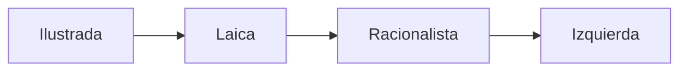

# Columna de opinión — La izquierda ilustrada laica racionalista

Sitio estático construido con [Zola](https://www.getzola.org) (generador de sitios en Rust). Diseño editorial inspirado en columnas de prensa clásicas: tipografía serif, columna estrecha, jerarquía clara.

The page URL:
https://italosalgado14.github.io/column-opin-1/

## Estructura

```
.
├── config.toml                  # Configuración Zola (título, taxonomías, syntax highlight)
├── content/
│   ├── _index.md                # Portada (hero + intro)
│   └── secciones/
│       ├── _index.md            # Listado de secciones
│       ├── 01-tesis-maestro.md
│       ├── 02-izquierda-ilustrada.md
│       ├── 03-mapa-global.md
│       ├── 04-emocion-vs-razon.md
│       ├── 05-caso-chileno.md
│       ├── 06-diagnostico-chile.md
│       ├── 07-salvedades.md
│       ├── 08-fuentes.md
│       └── 09-graficas-anexas.md
├── templates/
│   ├── base.html                # Layout (header, footer, theme toggle)
│   ├── index.html               # Portada con TOC
│   ├── section.html             # Listado de secciones
│   ├── page.html                # Página individual con TOC lateral y prev/next
│   ├── taxonomy_list.html       # Listado de temas
│   └── taxonomy_single.html     # Páginas de un tema
├── static/
│   ├── css/editorial.css        # CSS editorial (light + dark)
│   └── js/theme.js              # Toggle de tema
├── analytics/                   # Pipeline reproducible (ver analytics/README.md)
│   ├── claims.md                # Registro de afirmaciones del documento → estado
│   ├── data/                    # raw/ + processed/
│   ├── notebooks/               # Exploración interactiva (Jupyter Lab)
│   └── scripts/                 # Análisis reproducibles (Python + Plotly)
├── Dockerfile                   # Imagen Zola para dev/build
├── docker-compose.yml           # Servicios zola, build, analytics, analytics-build
└── .github/workflows/gh-pages.yml  # Deploy automático a GitHub Pages
```

## Desarrollo local con Docker

### Sitio (Zola)

Levanta el servidor de desarrollo con hot reload:

```bash
docker compose up
```

Abre <http://localhost:1111>. Cambios en `content/`, `templates/` o `static/` recargan automáticamente.

Para detener:

```bash
docker compose down
```

### Build estático (genera `public/`)

```bash
docker compose --profile build run --rm build
```

### Pipeline analítico (genera los gráficos)

Regenera todos los JSON Plotly que el sitio consume:

```bash
docker compose --profile analytics-build run --rm analytics-build
```

### Jupyter Lab para exploración interactiva

```bash
docker compose --profile analytics up analytics
```

Abre <http://localhost:8888> (sin contraseña en local). Los notebooks viven en `analytics/notebooks/`.

## Sin Docker (instalación nativa de Zola)

Si prefieres correr Zola directamente:

```bash
# Linux (binario oficial)
curl -sSL https://github.com/getzola/zola/releases/download/v0.19.2/zola-v0.19.2-x86_64-unknown-linux-gnu.tar.gz \
  | sudo tar -xz -C /usr/local/bin

zola serve   # http://127.0.0.1:1111
zola build   # genera public/
```

## Deploy a GitHub Pages

El workflow `.github/workflows/gh-pages.yml` se ejecuta automáticamente en cada push a `main`:

1. Crea el repositorio en GitHub.
2. En **Settings → Pages**, en "Build and deployment" elige `Source: GitHub Actions`.
3. Haz push a `main`. El workflow:
   - Instala Zola.
   - Detecta automáticamente la `base_url` correcta para tu Pages site (sea `usuario.github.io` o `usuario.github.io/repo`).
   - Construye y publica.

El sitio queda disponible en la URL que indica la pestaña **Actions → Deploy → page_url**.

## Cómo extender la columna

### Agregar texto a una sección
Edita el archivo `.md` correspondiente bajo `content/secciones/`. El frontmatter TOML controla orden (`weight`), descripción y metadata visual (`extra.lectura_min`, `extra.seccion`).

### Agregar una nueva sección
Crea `content/secciones/10-mi-seccion.md` con frontmatter como los existentes y `weight = 10`. Aparece automáticamente en el índice y en la navegación prev/next.

### Insertar un diagrama Mermaid
En cualquier `.md`:

````markdown

````

Mermaid ya está cargado vía CDN en `templates/page.html`.

### Insertar un gráfico desde el pipeline analítico

El sitio se integra con `analytics/` mediante un pipeline reproducible:

1. Crea o edita un script en `analytics/scripts/NN_titulo.py` que devuelva una `plotly.graph_objects.Figure`.
2. Regístralo en `analytics/scripts/build_all.py`.
3. Corre `docker compose --profile analytics-build run --rm analytics-build`. Esto deja un JSON en `static/data/charts/{id}.json`.
4. En cualquier `.md`, embede con el shortcode:

```markdown
{{ chart(id="gini-comparado",
         caption="Coeficiente de Gini comparado",
         source="Fuente: OECD IDD 2022") }}
```

Ver `analytics/README.md` para detalles del workflow y `analytics/claims.md` para el registro de afirmaciones verificables.

### Insertar HTML/JS directo (Plotly inline)

Si necesitas algo que no merece pipeline (ej: gráfico ad-hoc), también puedes insertar HTML+`<script>` directo en el `.md`. Plotly y Mermaid ya están pre-cargados en `templates/page.html`.

### Imágenes y figuras
Coloca PNG/SVG en `static/img/` y referencia con ``.

### Cambiar la tipografía o paleta
Todas las variables están en la cabecera de `static/css/editorial.css` (`:root` y `[data-theme="dark"]`).

## Notas sobre el contenido

El documento completo original (`izquierda_ilustrada_analisis.md`) está en la raíz del repositorio como respaldo de referencia. Las secciones bajo `content/secciones/` son la versión publicada y son las que debes editar para cambios visibles en el sitio.

## Licencia

El código del sitio (templates, CSS, configuración) puede usarse libremente. El contenido editorial (las secciones bajo `content/`) es opinión del autor.
